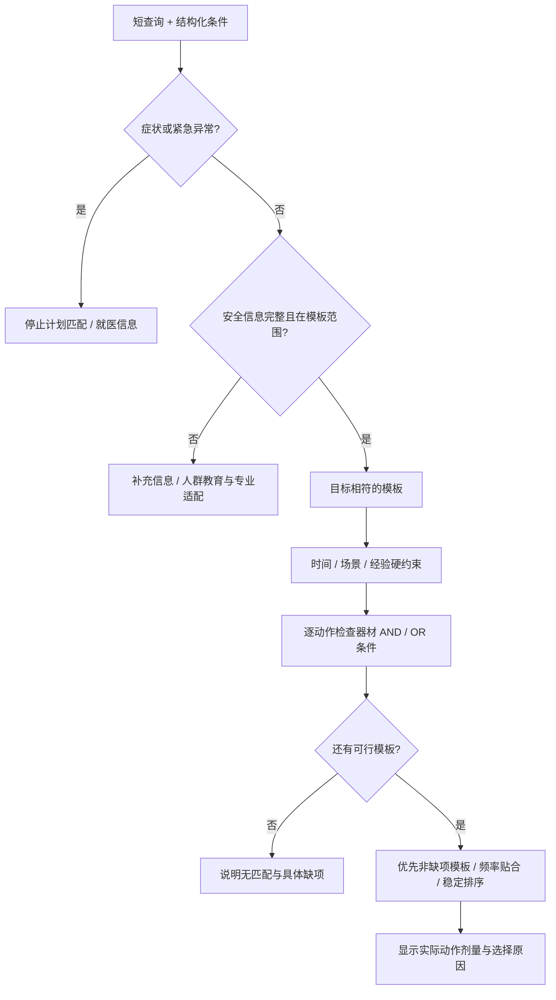

# 架构与推荐规则

## 数据单一来源

```text
/src/data/equipment/*.json ─┐
/src/data/*.json           ├─ /src/build.mjs → /index.html
/src/assets/*.svg          │                 → /dist/index.html
/src/core.js + app.js      │
/src/styles/site.css     ─┘
/tests → 校验 / 回归 / 浏览器交互
```

运行时没有后端、数据库、账号、CDN或模型API。构建脚本排序读取数据，嵌入HTML；Hash路由避免GitHub项目子路径刷新404。根目录与dist文件应该字节一致。

## 为什么不先上LLM推荐

有限模板与可执行资源限制可以用确定性规则处理。向量数据库或LLM不是首版必要条件，增加它们也不会自动增加医学正确性。将来接入自然语言理解时，它只能辅助解释意图，不能绕过相同安全条件、器材清单和模板校验。

## 匹配流程



`recommend`在`core.js`中是纯函数，可直接回归测试。安全门优先于“用户说自己健康”；文本出现危险症状会保守阻断。没有否定语义理解，不把“没有胸痛”自动转成医疗放行；这可能产生假阳性，页面已说明。

可行集合：目标匹配，计划天数≤可用天数，预估每次时间≤可用分钟，场景匹配，经验达到要求，每个动作至少有一组全部可用的器材组合。文本时间只能收紧，不能放宽表单条件。

`equipmentOptions`外层是OR，内层是AND。例如 `[["barbell","power-rack","flat-bench"],["smith","flat-bench"]]` 表示满足其中一套完整条件；这只是格式解释，不自行证明两个动作的生物力学或康复等效性。

排序不是疗效排名：先非缺项模板，再频率贴合，再确定性次序。无器材活动起步和单纯有氧模板标注缺失的抗阻/拉动内容。不为了“总能推荐一个”放松安全或资源限制。

公开模板可以不填健康信息直接阅读，页面明确这不等于已匹配或获医学许可；自动匹配必须筛查。这一区分避免把教育信息访问与医疗处方混为一谈。

## 搜索

规范化大小写、全半角与部分变音符；保留/重新组合韩文音节和其他必要文字结构。扩展中英及部分其他语言常用器材/目标别名，按名称、别名、正文等字段检索。语义范围有限，不宣称理解任意自然语言或所有医疗否定句。

全局检索按结果类型限制展示数量，器材页有连续加载；完整比较表与CSV不因分页丢失记录。增加新器材后，不需要修改硬编码页面计数。

## 隐私与安全

语言/主题偏好可自动保存在localStorage；健康档案仅在页面内存中；训练/身体记录必须用户勾选同意后才能保存。没有网络上传。共享设备、浏览器扩展或同源恶意脚本仍可能读到localStorage；本项目没有加密或账号隔离，不应用作临床病历系统。

所有数据插入HTML前转义；JSON中的`<`与特殊行分隔符转义；来源只接受HTTPS；外链使用`noopener noreferrer`；CSV对公式注入前缀转义；本地存储失败或内容损坏有回退，不伪报保存成功。下载通过本地Blob完成。

Hash route的未知ID安全显示未找到。SVG只使用可信本地原创资源，测试拒绝script、事件处理和外部引用。若引入用户上传SVG，必须另建安全清洗流程，不能复用“仓库可信资源”假设。

## 扩展边界

新增同主类器材只添JSON。新增动作要填写资源组合；新增模板要核对动作剂量、时间、每周安排、缺项和证据边界。新增主类需要更新categories、schema、图标和分类规则。新增疾病处方不能只加字段，必须先改变产品的临床治理和责任边界。

## 构建与验收

Node原生测试验证函数与数据，验证器检查字段/引用，浏览器脚本验证页面真实交互。两者都不能验证医学结论。HTTP测试模式检查真实同源持久化；受限环境document模式只检查内存中的页面和显式存储适配器。

本版不包含PWA service worker，以避免老内容被难以察觉地缓存并持续展示；离线交付由单文件解决。更新后重新下载或刷新新HTML即可，不存在隐藏的医学内容自动更新。
